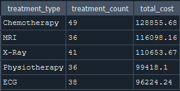
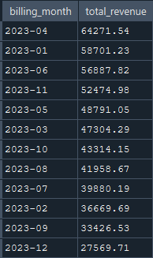
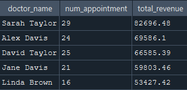

# 🏥 Hospital Management SQL Project

This project analyzes hospital operations using the **Hospital Management Dataset** from Kaggle.  
I used **DB Browser for SQLite** to explore relationships between patients, doctors, appointments, treatments, and billing.

---

## 🎯 Objective

To practice and showcase SQL skills — including joining multiple tables, aggregating metrics, building KPIs, and creating views — in a realistic healthcare setting.

---


## 📂 Dataset Source

This project uses the **Hospital Management Dataset** from [Kaggle](https://www.kaggle.com/datasets/kanakbaghel/hospital-management-dataset?resource=download).

---

## 🧰 Tools & Skills Used

- [DB Browser for SQLite](https://sqlitebrowser.org/)
- SQL (JOIN, GROUP BY, CASE, CREATE VIEW)
- Data modeling
- KPI calculations
- Analytical thinking

---

## ⚙️ Workflow

- Loaded dataset into SQLite and explored table relationships
- Identified primary and foreign keys
- Joined 3–4 tables to analyze treatments, appointments, and revenue
- Created views to simplify recurring analysis
- Generated insights to simulate decision-making in hospital operations

---

## 🔍 Key SQL Tasks

- Show doctors with more than 5 years of experience
- Join patients, doctors, and appointments to see visit history
- Summarize treatment count and total cost by type
- Track monthly revenue from billing data
- Identify top-performing doctors by total revenue
- Calculate no-show appointments
- Create views for monthly revenue and doctor KPIs

---

## 📊 Example Query Output

### Revenue by Treatment Type  
```sql
SELECT 
  treatment_type,
  COUNT(*) AS treatment_count,
  SUM(cost) AS total_cost
FROM treatments
GROUP BY treatment_type
ORDER BY total_cost DESC;
```


*Insight: Chemotherapy generate the highest revenue.*

### Revenue for the month
```sql
SELECT
	strftime('%Y-%m', bill_date) AS billing_month,
	SUM(amount) AS total_revenue
FROM billing
GROUP BY billing_month
ORDER BY total_revenue DESC;
```


*Insight: April 2023 (2023-04) recorded the highest total revenue among all months.*


### KPI: Income per doctor and time of appointments
```sql
SELECT 
	doctors.first_name || ' ' || doctors.last_name AS doctor_name,
	COUNT(distinct appointments.appointment_id) AS num_appointment,
	SUM(billing.amount) AS total_revenue
FROM billing 
JOIN treatments ON billing.treatment_id = treatments.treatment_id
JOIN appointments ON treatments.appointment_id= appointments.appointment_id
JOIN doctors ON doctors.doctor_id  = appointments.doctor_id
GROUP BY doctor_name
ORDER BY total_revenue DESC
```


 *Insight: Dr. Sarah Taylor has the highest number of appointments and generates the most total revenue among all doctors.*


### Creating and Using a View: doctor's kpi
To simplify repeated analysis and avoid rewriting complex joins, I created a SQL view called doctor_kpis.
This view summarizes each doctor’s number of appointments and total revenue.
```sql
CREATE VIEW doctor_kpis AS 
SELECT 
	doctors.first_name || ' ' || doctors.last_name AS doctor_name,
	COUNT(distinct appointments.appointment_id) AS num_appointment,
	SUM(billing.amount) AS total_revenue
FROM billing 
JOIN treatments ON billing.treatment_id = treatments.treatment_id
JOIN appointments ON treatments.appointment_id= appointments.appointment_id
JOIN doctors ON doctors.doctor_id  = appointments.doctor_id
GROUP BY doctor_name
ORDER BY total_revenue DESC;
```
```sql
-- Query the view like a table
SELECT *
FROM doctor_kpis
LIMIT 5;
```


*Insight: Using a view like doctor_kpis helps simplify recurring analysis and improves query readability.*


## 📚 Key Takeaways

- Practiced real-world SQL operations such as `JOIN`, `GROUP BY`, and `CREATE VIEW`
- Analyzed hospital operations using multi-table queries
- Identified high-revenue treatments and top-performing doctors
- Created reusable views to simplify analysis
- Strengthened skills in data modeling and healthcare data analysis

## 🔗 Project Files

- [`hospital_analysis.sql`](hospital_analysis.sql) – Full SQL script with all queries
- `images/` – Query result screenshots for visual explanation
- `README.md` – Project overview and documentation

